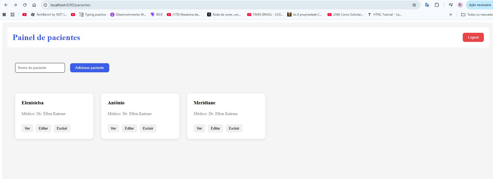
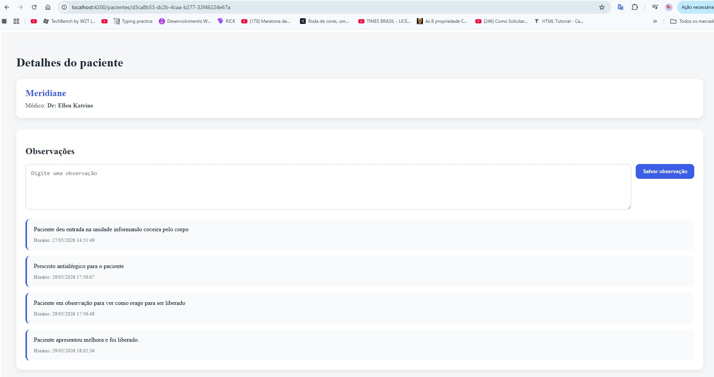
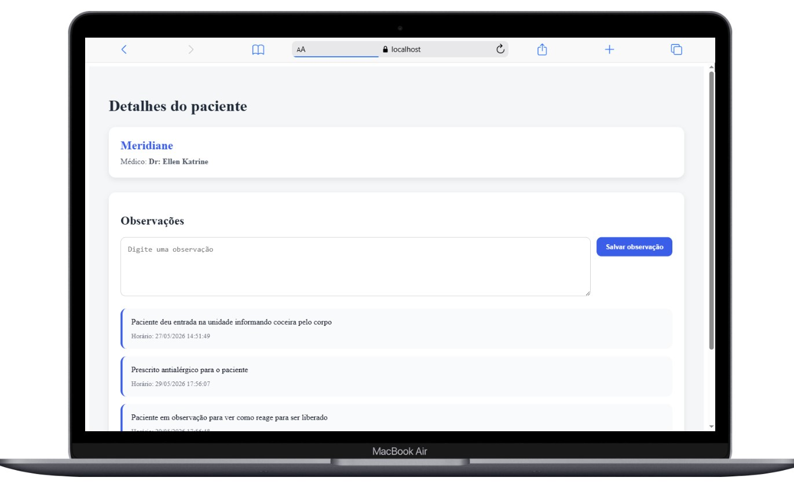

# medcontrol-api
Sistema Fullstack para gerenciamento de pacientes e observações médicas desenvolvido com Java, Spring Boot, Angular e PostgreSQL.

O projeto permite que médicos realizem autenticação segura, gerenciem seus próprios pacientes e registrem observações clínicas, garantindo que cada profissional tenha acesso apenas aos seus próprios dados.

# Funcionalidades
##### Autenticação
##### Cadastro de médicos
##### Login com JWT  
##### Rotas protegidas
##### Controle de acesso baseado no médico autenticado

# Pacientes
#### Criar paciente
#### Listar pacientes do médico logado
#### Buscar paciente por ID
#### Editar paciente
#### Excluir paciente

# Observações
#### Criar observações para pacientes
#### Listar observações de um paciente

# Segurança
#### Spring Security
#### JWT Authentication
#### Interceptor Angular para envio automático do token
#### Guard Angular para proteção de rotas
#### Restrição de acesso aos próprios pacientes

# Tecnologias Utilizadas
## Backend
#### Java 21
#### Spring Boot
#### Spring Security
#### JWT
#### Spring Data JPA
#### PostgreSQL
#### Maven

## Frontend
#### Angular
#### TypeScript
#### Reactive Forms
#### Angular Router
#### Guards
#### Interceptors
#### HttpClient

## Estrutura do Projeto
medcontrol/
│
├── backend/
│   └── Spring Boot
│
└── frontend/
    └── Angular

# Fluxo de Autenticação
#### Médico realiza login.
#### Backend gera um token JWT.
#### Frontend armazena o token.
#### Interceptor envia o token automaticamente em cada requisição.
#### Backend identifica o médico autenticado.
#### Apenas pacientes pertencentes ao médico logado podem ser acessados. 

# Banco de Dados

### Relacionamentos:

Medico
 └── Pacientes
      └── Observacoes

# Executando o Backend

#### Clone o projeto:

#### git clone URL_DO_REPOSITORIO

#### Acesse a pasta:

#### cd backend

#### Configure o PostgreSQL em:

#### application.properties

#### Execute:

#### ./mvnw spring-boot:run

# Executando o Frontend

#### Acesse a pasta:

#### cd frontend

#### Instale as dependências:

#### npm install

#### Execute:

#### ng serve

#### A aplicação estará disponível em:

#### http://localhost:4200      

# Imagens do sistema
# Login

# Painel de pacientes

# Detalhes do paciente

    

